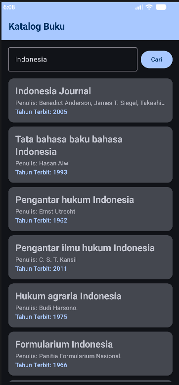
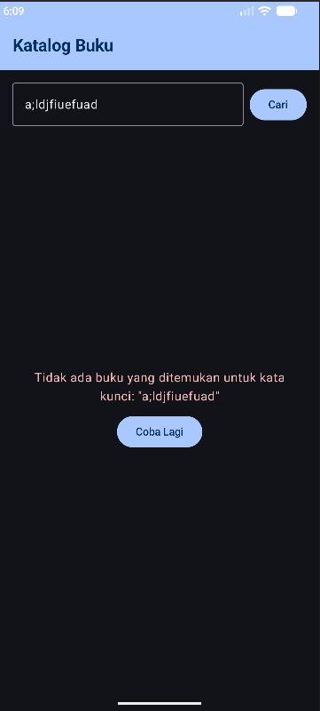
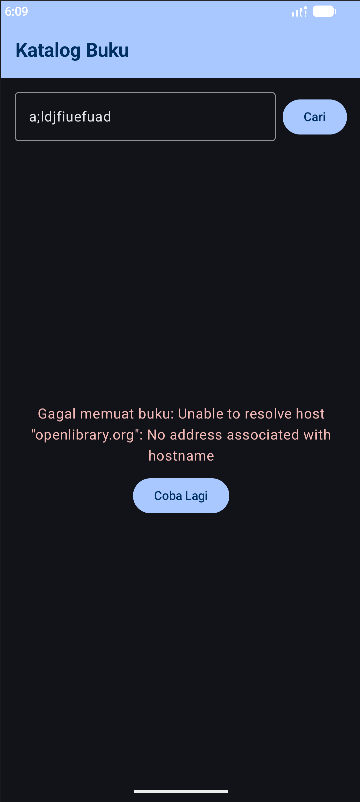
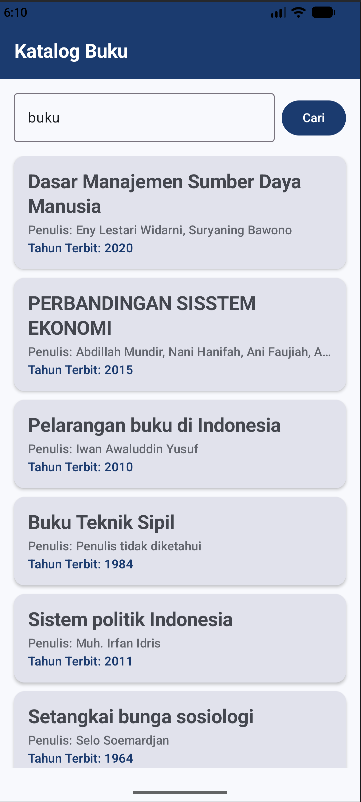

# BukuApp - Responsi Pemrograman Mobile

Nama : Bagas Eka Permana NIM : H1D024076 Shift H

Aplikasi Android katalog buku sederhana berbasis **Jetpack Compose** dan arsitektur **MVVM (Model-View-ViewModel)** menggunakan **Open Library Search API**.

---

## Video Demo
**Link YouTube:** [https://youtu.be/yjIvx1hT-Mk](https://youtu.be/yjIvx1hT-Mk)

---

## Screenshot Aplikasi

  
  
  
  
  

| Screenshot 1 | Screenshot 2 | Screenshot 3 | Screenshot 4 | Screenshot 5 |
| :---: | :---: | :---: | :---: | :---: |
| Katalog Buku (Dark) | Pencarian Kosong | Error Koneksi | Katalog Buku (Light) | Detail Buku |
